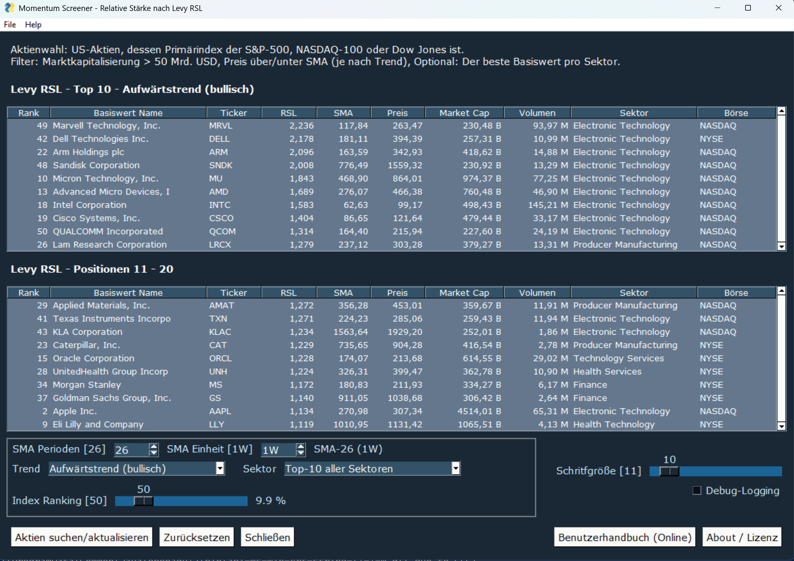

# RSL Momentum Screener – Benutzerhandbuch

**Relative Stärke nach Levy (RSL)** · Version 1.0

Dokumentation: <https://github.com/contensys/trading-tools-rsl-docs/tree/release/1.0.0>

> **Haftungsausschluss:** Dieses Tool dient ausschließlich Bildungs- und Forschungszwecken.
> Es stellt **keine Anlageberatung** dar, und es werden keine Anlageempfehlungen gegeben.
> Die Entwickler sind keine Finanzberater und übernehmen keine Verantwortung für finanzielle
> Entscheidungen oder Verluste, die aus der Nutzung dieses Tools resultieren. Konsultieren Sie
> immer einen professionellen Finanzberater, bevor Sie Anlageentscheidungen treffen.

**Inhalt**

1. Überblick und Zweck
2. Installation
3. Bedienung des Screener Tools
4. Ergebnistabellen und Spaltenbeschreibung
5. Filtereinstellungen
6. Strategie richtig anwenden


---

## 1. Überblick und Zweck

Der **RSL Momentum Screener** ist ein Desktop-Programm, mit dem Sie US-Aktien mit besonders
starker oder besonders schwacher **relativer Stärke** im Vergleich zu ihrem gleitenden
Durchschnitt (SMA) auffinden können. Grundlage ist die **Relative Stärke nach Levy (RSL)**.

Das Tool durchsucht die Aktien der großen US-Indizes **S&P-500**, **NASDAQ-100** und
**Dow Jones**, berechnet für jede Aktie das Verhältnis von Kurs zu gleitendem Durchschnitt und
zeigt die stärksten (bzw. schwächsten) Werte als Rangliste an:

- **Top 10** – die zehn Basiswerte mit der höchsten relativen Stärke
- **Positionen 11–20** – die nächsten zehn Werte der Rangliste

**Filter Kriterien**  

- Der letzte **Schlußkurs** muss höher als der konfigurierte SMA sein. (Bei Abwärtstrend, niedriger) 
- Die **Marktkapitalisierung** ist gerößer als 50 Mrd US$
- Der Basiswert muss in den oben genannte **Indexes primär gelistet** sein
- Der RSL-Wert des Basiswertes muss in den **Top 50 des Indexes** liegen (oder dessen konfigurierter Wert). Mehr Details hierzu finden sie im Kapitel "Strategie richtig anwenden".

**Datenquelle**

Die Berechnung erfolgt live über die öffentliche TradingView-Datenbank. Es ist kein Konto und
keine Anmeldung erforderlich. Die Daten sind um 15 Minuten verzögert.  

---

## 2. Installation

Die fertigen Programmpakete stehen im OneDrive-Bereich zum Download bereit:

➡️ **Download:** <https://schranz.sharepoint.com/:f:/s/bigbusiness/IgBePagCvFo4TKmHnN8BnKdQAZoA5pxNeliCAKHlAJi7RkM>

| Plattform | Paketname                              |
|-----------|----------------------------------------|
| macOS     | `RSL-MomentumScreener-macos-arm.zip`   |
| Windows   | `RSL-MomentumScreener-win-x86-64.zip`  |

### 2.1 Installation MacOS (Apple Silicon / ARM)

Das macOS-Paket ist **signiert und notariell beglaubigt (notarized)** und kann daher ohne
zusätzliche Sicherheitswarnungen gestartet werden.

1. Datei `RSL-MomentumScreener-macos-arm.zip` herunterladen. Das ZIP-Archiv wird in der Regel
   automatisch entpackt.
2. Die App **`RSL-MomentumScreener.app`** an einen in den Ordner **`/Programme` (/Applications)**.
3. App per Doppelklick starten.

> ⚠️ **Wichtige Einschränkung:** Starten Sie die App **nicht direkt aus dem Ordner „Downloads“**.
> MacOS führt Programme aus dem Download-Ordner in einer eingeschränkten Umgebung aus, wodurch
> die App nicht korrekt funktioniert. Verschieben Sie die App vorher in den Ordner „Programme“.

### 2.2 Installation Windows (64-Bit)

Das Windows-Paket ist **nicht signiert**. Windows Defender (SmartScreen) wird den Start daher
zunächst blockieren. Das ist normal und kein Hinweis auf Schadsoftware.

1. Datei `RSL-MomentumScreener-win-x86-64.zip` herunterladen und entpacken.
2. Die Datei **`RSL-MomentumScreener.exe`** per Doppelklick starten.
3. Erscheint die Meldung **„Der Computer wurde durch Windows geschützt“**:
   - Auf **„Weitere Informationen“** klicken.
   - Anschließend auf **„Trotzdem ausführen“ (Run anyway)** klicken.

Diese Bestätigung ist nur beim ersten Start erforderlich.

---

## 3. Bedienung des Screener Tools

Nach dem Start erscheint zunächst ein **Lizenz-/Hinweisfenster (About / Lizenz)**. Mit **„OK“**
bestätigen Sie die Nutzungsbedingungen und gelangen in die Anwendung. Mit **„Cancel“** wird die
Anwendung beendet.  



### 3.1 Daten laden

1. Der Screener startet mit den für die RSL Strategie passenden Filtereinstellungen. Diese können nach Wunsch nud Bedarf angepasst werden (siehe Abschnitt 5).
2. Auf **„Aktien suchen/aktualisieren“** klicken.
3. In der Statuszeile erscheint zunächst *„Lade Daten, bitte um etwas Geduld...“*, danach die
   Anzahl der gefundenen Aktien (z. B. *„42 Aktien von 507 Indexeinträgen gefunden.“*).
4. Die Ergebnisse werden in den beiden Tabellen **Top 10** und **Positionen 11–20** angezeigt.

> ℹ️ **Wichtig:** Nach **jeder** Änderung an den Filtereinstellungen müssen Sie erneut auf
> **„Aktien suchen/aktualisieren“** klicken, damit die Tabellen aktualisiert werden.

> ⏳ **Geduld bei „Bester Basiswert pro Sektor“:** In diesem Modus wird jeder Sektor einzeln
> durchsucht. Die Abfrage dauert daher deutlich länger als die Standard-Suche.

### 3.2 Schaltflächen

| Schaltfläche                  | Funktion                                                              |
|-------------------------------|----------------------------------------------------------------------|
| **Aktien suchen/aktualisieren** | Lädt bzw. aktualisiert die Ergebnisse anhand der Filtereinstellungen. |
| **Zurücksetzen**              | Setzt alle Filter auf die Standardwerte zurück und leert die Tabellen.|
| **Schließen**                 | Beendet die Anwendung.                                                |
| **About / Lizenz**            | Zeigt die Lizenz- und Hinweisinformationen an.                 |

---

## 4. Die Ergebnistabellen – Spaltenbeschreibung

| Spalte             | Bedeutung                                                                                              |
|--------------------|-------------------------------------------------------------------------------------------------------|
| **Rank**           | Platzierung innerhalb des Index-Rankings (1 = höchste relative Stärke, bei Abwärtstrend die schwächste Stärke). |
| **Basiswert Name** | Vollständiger Name des Unternehmens bzw. der Aktie.                                                    |
| **Ticker**         | Börsenkürzel (Symbol) der Aktie.                                                                       |
| **RSL**            | Relative Stärke nach Levy = **Kurs ÷ gleitender Durchschnitt (SMA)**. Siehe Abschnitt 6.               |
| **SMA**            | Wert des gewählten gleitenden Durchschnitts (z. B. SMA-26 auf Wochenbasis).                            |
| **Preis**          | Aktueller Kurs (Schlusskurs) der Aktie.                                                                |
| **Market Cap**     | Marktkapitalisierung in Milliarden US-Dollar (B = Billion/Mrd.).                                       |
| **Volumen**        | Handelsvolumen in Millionen (M).                                                                       |
| **Sektor**         | Sektor, dem die Aktie zugeordnet ist.                                                          |
| **Börse**          | Handelsplatz der Aktie (NASDAQ oder NYSE).                                                             |

---

## 5. Filtereinstellungen

| Filter                  | Standardwert                  | Bedeutung                                                                                                                                                  |
|-------------------------|-------------------------------|----------------------------------------------------------------------------------------------------------------------------------------------------------|
| **SMA Perioden**        | **26**                        | Anzahl der Perioden für den gleitenden Durchschnitt. Auswahl: 10, 20, 26, 34, 50, 100, 200, 250.                                                          |
| **SMA Einheit**         | **1W** (Woche)                | Zeiteinheit je Periode: `1D` = Tag, `1W` = Woche, `1M` = Monat. Beispiel: *SMA Perioden 26* + *Einheit 1W* = **SMA über 26 Wochen**.                       |
| **Trend**               | **Aufwärtstrend (bullisch)**  | Suchrichtung. *Aufwärtstrend (bullisch)*: Kurs über dem SMA. *Abwärtstrend (bärisch)*: Kurs unter dem SMA.                                                 |
| **Sektor**              | **Top-10 aller Sektoren**     | Ergebnismodus. *Top-10 aller Sektoren*: gemeinsame Rangliste über alle Sektoren. *Bester Basiswert pro Sektor*: die jeweils stärkste Aktie je Sektor.     |
| **Index Ranking**       | **50**                        | Ein Basiswert erscheint nur, wenn er im Index unter den besten **N** Werten liegt. Je kleiner der Wert, desto strenger der Filter (Bereich 10–250).        |
| **Schriftgröße**        | **10**                        | Schriftgröße der Ergebnistabellen (Bereich 9–20). Rein optische Einstellung.                                                                              |
| **Debug-Logging**       | **aus**                       | Schreibt detaillierte Diagnoseinformationen in die Protokolldatei `screener-levy-rsl.log`. Nur für die Fehleranalyse erforderlich.                        |

**Feste Auswahlkriterien** (nicht veränderbar): US-Aktien, deren Primärindex der S&P-500,
NASDAQ-100 oder Dow Jones ist, gehandelt an NASDAQ oder NYSE, mit einer Marktkapitalisierung
von **über 50 Mrd. USD**.

> Mit **„Zurücksetzen“** stellen Sie alle Filter wieder auf die oben genannten Standardwerte ein.

---

## 6. Strategie richtig anwenden

Die Standardeinstellungen (SMA-26 auf Wochenbasis, Aufwärtstrend, Top-10 aller Sektoren,
Index Ranking 50) bilden die **Hauptstrategie** ab und sind für die meisten Anwender die
richtige Wahl.

### Die RSL-Kennzahl verstehen

Die **Relative Stärke nach Levy (RSL)** ist das Verhältnis von Kurs zu gleitendem Durchschnitt:

```
RSL = Kurs ÷ SMA
```

| RSL-Wert         | Bedeutung                                                                                  |
|------------------|--------------------------------------------------------------------------------------------|
| **RSL > 1,0**    | **Aufwärtstrend (bullisch)** – der Kurs liegt über dem Durchschnitt.                        |
| **RSL ≈ 1,0**    | **Seitwärtstrend** – keine klare Richtung. Die RSL-Strategie funktioniert hier nur **mäßig** bis **nicht**.  |
| **RSL < 1,0**    | **Abwärtstrend (bärisch)** – der Kurs liegt unter dem Durchschnitt.                         |

#### Zur Trendstärke

Je näher der RSL-Wert an 1,0 liegt, desto schwächer der Trend und folgedessen wird man im Basiswert länger investiert sein. Ich empfehle in Werte mit einem Trend von mehr als 10% zu investieren (>1,10 bei Aufwärtstrends oder <0,90 bei Abwärtstrend).

#### Zur Größenordnung

Ein bärischer Wert kann nur zwischen **0 und 1** liegen, ein bullischer Wert
ist dagegen **theoretisch unbegrenzt** nach oben möglich. Ein RSL von **0,5** entspricht somit einem
Rückgang (Drawdown) von rund **50 %**, während ein RSL von **2,0** einer Aufwärtsbewegung von
etwa **100 %** der gewählten Zeitspanne des SMA entspricht. Bsp: SMA-26 (1W) sind somit eine Zeitspanne von 26 Wochen.

### Das Ranking verstehen

Die Zahl in der Spalte **"Rank"** gibt die aktuelle Position des Basiswertes (Aktie) im Index an. Im Index wird die relative Stärke (RSL) für **alle** Aktien berechnet und nach diesem sortiert. Bei gewähltem `Aufwärtstrend` wird der RSL-Wert abwärts sortiert. Bei gewählten `Abwärtstrend` in aufsteigender Folge. Somit hat die Nr. 1 den stärksten Trend in der jeweiligen Trendfolge.  

### Empfehlungen zur Trendwahl

- **Wählen Sie den Trend immer entsprechend dem übergeordneten (primären) Trend des
  S&P-500-Index.**
- **Handeln Sie diese Strategie niemals gegen den Trend. Verwenden Sie die bärische Strategie nicht, solange der Index im Bullenmarkt befindet.**
- Liegt die RSL bei oder nahe **1,0** (Seitwärtstrend), liefert die Strategie keine verwertbaren
  Signale (siehe Kapitel "Trendstärke" oberhalb).

### Umsetzung der Strategie

Bitte folgen Sie der Anleitung, wie wir diese im Seminar gelernt haben. Danke.  

---

*© 2026 Juergen Schranz – The DevOps Engineers · Lizenz: Apache License 2.0*
